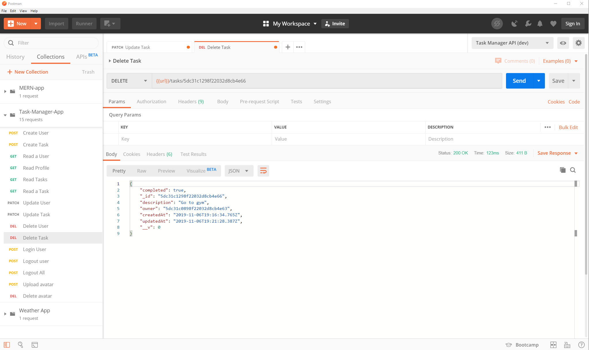

# Node/Express Task Management

A task management project for real-world-business based on Node, Express and MongoDB.

The goal of this project is to create a RESTful API which can be consumed by front-end application to manage the tasks of users.

## Features

* This project is built on top of Node/Express.
* MongoDB database is used to store users and their tasks.
* JWT (JSON Web Tokens) are used for authentication.
* This project uses Express library to create different routes related to users and tasks.
* Mongoose library is used to create User and Task models to be stored in MongoDB database.
* SendGrid API is used to send welcome and account deletion emails when user is created or deleted.
* Postman can be used to test the different routes.

## User Routes

1. Sign up user – POST http://localhost:3000/users 
   -	Name, email and password are the required fields in the request body.
   -	Sends back JSON response with saved user and authorization token. 
   
   

2. Login user – POST http://localhost:3000/users/login
   -	Email and password are the required fields in the request.
   -	Sends back JSON response with logged in user and authorization token. 
   
   

3. Read user profile – GET http://localhost:3000/users/me
   -	User must be logged in to access this route.
   -	Sends back the JSON response with user details of logged in user.
   
   

4. Update user – PATCH http://localhost:3000/users/me
   -	User must be logged in to access this route.
   -	Updates are sent in the request body.
   -	Sends back the JSON response with updated user profile.
   
   

5. Logout user – POST http://localhost:3000/users/logout
   -	User must be logged in to access this route.
   -	This route deletes the authentication token from user profile.

6. Logout all – POST http://localhost:3000/users/logoutAll
   -	User must be logged in to access this route.
   -	This route deletes all the authentication tokens from user profile. User gets logged out of all active sessions.

7. Delete user – DELETE http://localhost:3000/users/me
   -	User must be logged in to access this route.
   -	This route deletes the user from the database and sends back the deleted user in response body.
   
   

8. Upload profile picture – POST http://localhost:3000/users/me/avatar
   -	User must be logged in to access this route.
   -	This route uploads profile picture in logged in user’s profile.
   -	Multer middleware is used for uploading pictures.

9. Delete profile picture – DELETE http://localhost:3000/users/me/avatar
   -	User must be logged in to access this route.
   -	This route deletes profile picture in logged in user’s profile.
   
## Task Routes

1. Create task – POST http://localhost:3000/tasks
   -	User must be logged in to access this route.
   -	Description is the required field in the request body.
   -	Sends back the JSON response with saved task.
   
   
 
2. Read tasks – GET http://localhost:3000/tasks
   -	User must be logged in to access this route.
   -	Sends back all the tasks related to logged in user’s profile.
   
   

3. Read a task – GET http://localhost:3000/tasks/:id
   -	User must be logged in to access this route.
   -	Sends back the requested task.
   
   

4. Update a task – PATCH http://localhost:3000/tasks/:id
   -	User must be logged in to access this route.
   -	Updates are sent in the request body.
   -	Sends back the JSON response with updated task.
   
   

5. Delete a task – DELETE http://localhost:3000/tasks/:id
   -	User must be logged in to access this route.
   -	Deletes task from logged in user’s profile and sends backthe deleted task in response body.
   
   
   
## Build Setup

```
# Clone project
git clone https://github.com/KhushdeepSidhu/task-manager-node-app.git

# install the packages with npm or yarn
cd task-manager-note-app
npm install 
# or yarn 
yarn install 

## development
npm run dev
# or yarn
yarn run dev

## production
npm run start
# or yarn
yarn run start

## Run automated unit tests
npm run test
# or yarn
yarn run test
```
App is deployed on Heroku production environment. App can be accessed on this url - https://sidhu-task-manager-api.herokuapp.com/
App is an RESTful API. No front end is created for the app. The production app routes can be tested using POSTMAN by replacing
localhost:3000 with url https://sidhu-task-manager-api.herokuapp.com/. 
